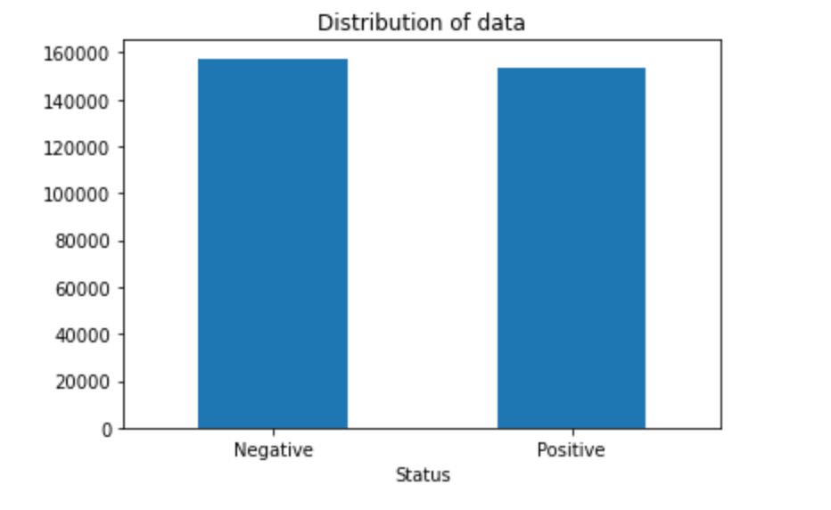
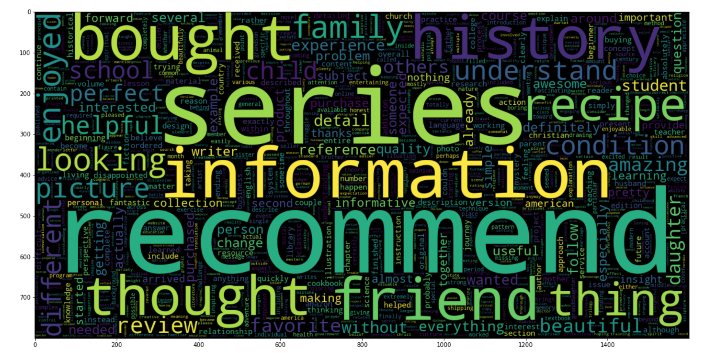
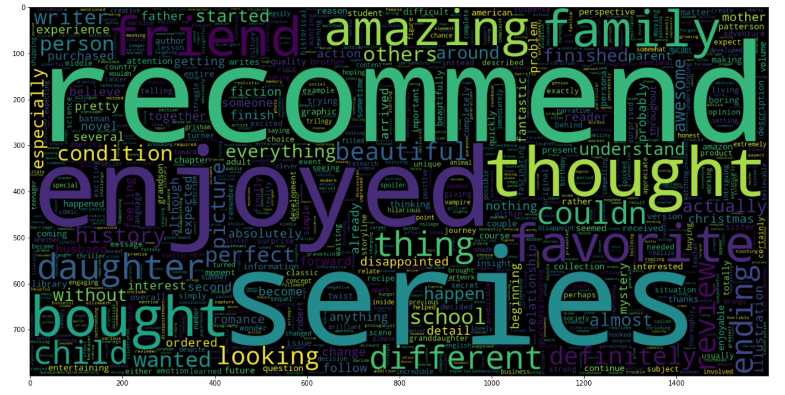
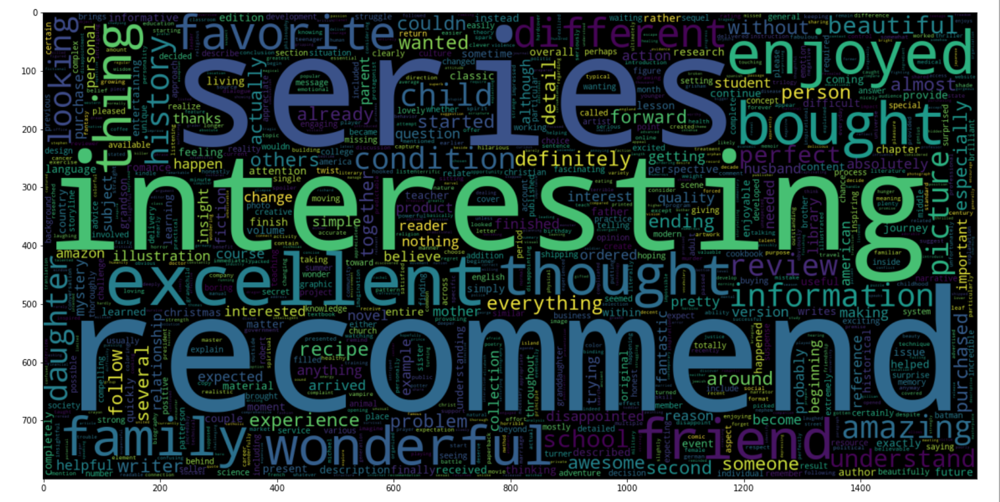

# Predicting NYT Best Sellers

## Overview

   For this project I wanted to better predict what kind of book would make it onto the 
   New York Times Best Sellers List given reviews.
   By Doing this I hop to help both independent authors and larger publishing houses determine a books 
   selling potential given just one review. 
   
   
   The data that I used for reviews can be found at 
   https://s3.amazonaws.com/amazon-reviews-pds/tsv/index.txt 
   and I accessed the NEW York Times API for the list of books to include. The code for this 
   can be found in NYT_Api_Calls.ipynb and the resulting data can be found in the data folder.

   When an Author first tries to get published, they often have alpha and beta readers that
   give their thoughts to the author before they either go to a publishing house or publish
   independently. While the general reviews aren't a one to one comparison for such a thing 
   they are easily accessable and can be thought of as a person's thoughts on the material.
   
   The mystery of how a book will be recieved or how those thoughts correlate with sales is
   a big topic. This project aims to try and predict one of the biggest factors a book will
   sell and be recieved well; their inclusion on the New York Times Best Seller List. 

   In order to preform this task I wanted to understand what kind of words were associated 
   with a book that would make it onto the list. 

    
## Methodology
1. Gather and merge the data along reviews and its inclusion in the NYT
2. Perform EDA with statistical analysis to determine statistical significance of tokenized words.
4. Test baseline model and tune to Accuracy
5. Test different models with different hyper perameters and use cross validation
6. Implement the different models to preform on the data set

## Results

   For this project I started with a giant dataset, it was an issue to even load the data. So the
   first step had to be to trim it down. I decided to find out the books that made it onto the
   NYT and find the reviews for those, then just match it with the negative class.
    
   This would allow me to get a ballanced data set from the start and then supplement it with
   webscrapping. Once this was done I started cleaning the reviews with regex and lammentizing
   the words with tfidf. 
    
   This would be the result of the lamentized words for the negative dataset
    
   This would be the result of the lamentized words for the positve dataset
    
   This would be the result for the combined dataset
   
   
   After this I moved on to modeling, as I wanted to be sure that a book that I said would make it
   on to the list did and that a book that I said would not didn't I was conscerned with both the 
   possitive and negative class and thus decided to go with accuracy as the evaluation metric.
   
   My initial baseline model was a  Bernouli Naive Bayse classification, this gave us an
   accuracy score of 71%. Not a terrible score, but I thought we could do better using different
   models. Next I chose LinearSVC and got an accuracy score of 75%, slightly better, but we wanted one
   more model to make sure we would chose the correct one to processed with hyper parrameter tuning.
   Lastly I chose Logistic Regression and got an accuracy score of 75%. This had the same accuracy score 
   as well as predicting better on the Possitve class without sacrificing much on the Negative class
    
   Next we moved on to hypertunning the parameters using grid search for Logistic Regression, unfortunaltly
   because of the size of the data set and the stregnth of my computer it has been running for more then 24 
   Hours and I've yet to find a solution for the processing time. I have no choice but to let it run over the 
   weekend and hope that it runs to completion soon.
   
## Modeling
Using Scikit-learn 6 classification models were crated.
- Logistic Regression 
- LinearSVC
- Bernouli Naive Bayse

If worse comes to worse the accuracy score for my model isn't terrible and I can spend the weekend trying to find 
solutions such as using remote services or moving on to neural networks and recommendation systems.
 

## Conclusion
The synthesized data was analyzed and modeled. I saw that when talking about a book the most important thing is to 
mention the impact of the story and characters as well as inspiring a want to reccommend it to friends or other 
people. 

## Future Work
-Tune the Model to better predict on both classes
-Implement a recocmendation system using these classes
-Implement CNN to better improve performance

## Repository Structure

    "├── README.md                    <- The top-level README for reviewers of this project\n",
    "├── EDA.ipynb               <- Notebook that gpes pver out modling process\n",
    "├── images                       <- Both sourced externally and generated from Code\n",       
    
**Author**  
[Kelvin Arellano](https://github.com/Kelvin-Arellano) 
